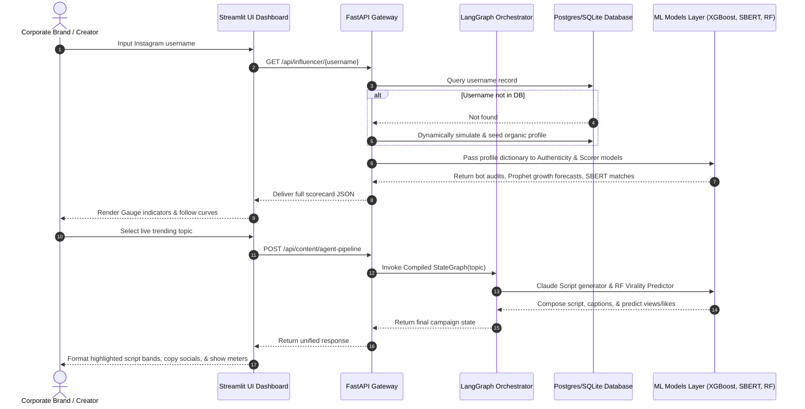

# ⚡ Ratefluencer AI

> Predict Influence. Create Virality.

[](https://github.com/http-pruthvi/Ratefluencer)
[](https://www.python.org/)
[](https://fastapi.tiangolo.com/)
[](https://streamlit.io/)

Ratefluencer is an all-in-one, AI-powered creator intelligence auditing and autonomous campaign marketing execution engine. Built for digital brands seeking high-converting creator alignment and automated cross-platform script copywriting, Ratefluencer utilizes Isolation Forest anomaly checking to detect follower fraud, FB Prophet time-series forecasts to map growth, Sentence-BERT FAISS dense spaces to match campaigns semantically, and sequential LangGraph workflows to discover trends, script engaging vertical reels via Claude 3.5, and forecast virality metrics using Random Forests before publishing.

---

## 🏗️ System Architecture

The Ratefluencer platform implements a strictly decoupled, 6-layer design pattern:

### 🧩 ASCII Architecture Overview
```
                               +------------------------------------+
                               |     Streamlit Frontend Client      |
                               |   (Obsidian HSL UI, Plotly, CSS)   |
                               +-----------------+------------------+
                                                 | HTTP REST API
                                                 v
                               +-----------------+------------------+
                               |         FastAPI REST Gateway       |
                               |   (CORS, SQLite/Postgres ORM, schemas)
                               +--------+-----------------+---------+
                                        |                 |
                 +----------------------+                 +-----------------------+
                 |                                                                |
                 v                                                                v
+-------------------------------+                      +-------------------------+-----+
| TRACK 1: Influencer Scorer    |                      | TRACK 2: AI Script Agent      |
+-------------------------------+                      +-------------------------------+
| * IsolationForest Bot Audit   |                      | * Multi-Feed Trend Collectors |
| * Prophet Timeline Forecast  |                      | * Dynamic Trend Ranker        |
| * SBERT Vector Brand Matcher  |                      | * Claude 3.5 Script Supervisor|
| * XGBoost Success Classifier  |                      | * RandomForest Virality Engine|
+-------------------------------+                      +-------------------------------+
```

### 📊 Mermaid Data Flow Diagram


---

## 🛠️ Technical Stack

| Layer | Component | Core Technology | Strategic Purpose |
| :--- | :--- | :--- | :--- |
| **Frontend** | Dashboard Client | **Streamlit** + **Plotly** | Glassmorphic dark UI, radial sweeps & growth curves |
| **Gateway** | Rest Controller | **FastAPI** + **Uvicorn** | CORs-compliant, asynchronous microservice endpoints |
| **Agent** | Orchestration | **LangGraph** (StateGraph) | Multi-node autonomous trend & copywriting state machine |
| **ML Engine** | Audits & Match | **scikit-learn**, **XGBoost**, **Prophet** | Anomaly checking, success forecasting, time-series projections |
| **NLP Vectors**| Brief Matching | **SentenceTransformers** + **FAISS** | 384-dimension dense vector space matching (all-MiniLM-L6-v2) |
| **Feeds** | Ingestion Scrapers | **PRAW**, **Google Client**, **feedparser** | Live crawling across Subreddits, YouTube, and RSS feeds |
| **Persistence**| Database & Queue | **PostgreSQL**, **SQLite**, **Redis** | Relational SQLAlchemy models, caching layers & fail-safes |

---

## 🚀 Quick Start Guide

Get the entire Ratefluencer platform running locally in seconds:

### ⚡ The Instant Docker Speedrun (Recommended)
```bash
# 1. Clone the repository
git clone https://github.com/http-pruthvi/Ratefluencer.git
cd Ratefluencer

# 2. Install package dependencies
pip install -r requirements.txt

# 3. Spin up full services (FastAPI, SQLite, and Environment structures)
docker-compose up -d

# 4. Start the interactive frontend portal
streamlit run frontend/app.py
```
Navigate to `http://localhost:8501` to view the beautiful dashboard!

---

### 💻 Step-by-Step Local Developer Setup
If you want to run the microservices individually without Docker:

#### 1. Clone and Configure
```bash
git clone https://github.com/http-pruthvi/Ratefluencer.git
cd Ratefluencer
cp .env.example .env
```
*(By default, `.env` points to local SQLite so it boots instantly without external servers).*

#### 2. Install Packages
```bash
pip install -r requirements.txt
```

#### 3. Generate Database & Seed Mock Data
```bash
python data/synthetic/generate.py
```

#### 4. Train All Machine Learning Models
```bash
python models/train_all.py
python models/train_track2.py
```

#### 5. Start FastAPI Backend Gateway
```bash
uvicorn api.main:app --host 127.0.0.1 --port 8000 --reload
```

#### 6. Start Streamlit Front-End Dashboard
In a new terminal shell:
```bash
python -m streamlit run frontend/app.py --server.port 8501
```
Open your browser and navigate to `http://localhost:8501`.

---

## 🔌 API Endpoints Catalog

Ratefluencer exposes 8 key REST routes for high-performance integrations.

| Endpoint | Method | Input Parameters | Example Request Shape | Expected Response (200 OK) |
| :--- | :--- | :--- | :--- | :--- |
| `GET /` | `GET` | None | None | `{"success": true, "data": {"status": "Online", "version": "1.0.0"}}` |
| `/api/influencer/{username}` | `GET` | String handle | Path parameter | `{"success": true, "data": {"authenticity_score": 96.5, "ratefluencer_score": 88.2}}` |
| `/api/influencer/analyze` | `POST` | Raw metrics JSON | `{"followers": 10000, "avg_likes": 500}` | `{"success": true, "data": {"authenticity_score": 92.4, "ratefluencer_score": 81.0}}` |
| `/api/influencer/{id}/brand-matches` | `GET` | Integer Creator ID | Path parameter | `{"success": true, "data": [{"brand": "FitTrack", "match_percentage": 95.8}]}` |
| `/api/influencer/search-by-brief` | `POST` | Brand brief string | `{"brief": "active yoga-wear brand"}` | `{"success": true, "data": [{"username": "@fit_creator", "match": 88.3}]}` |
| `/api/trends` | `GET` | Integer Limit | Query parameter | `{"success": true, "data": [{"topic": "Multi-agent AI", "trend_score": 95.2}]}` |
| `/api/trends/score` | `POST` | Custom topic string | `{"topic": "WebAssembly in 2026"}` | `{"success": true, "data": {"topic": "WebAssembly", "trend_score": 80.5}}` |
| `/api/content/agent-pipeline` | `POST` | Custom topic & niche | `{"topic": "GPT-5", "category": "tech"}` | `{"success": true, "data": {"script": "[HOOK]...", "virality_score": 79.5}}` |

---

### 🔍 Complete Request & Response Examples

#### 1. Analyze Influencer (`POST /api/influencer/analyze`)
*   **Request:**
    ```json
    {
      "username": "@fitness_coach",
      "followers": 50000,
      "avg_likes": 4200,
      "posting_frequency": 3.2,
      "follower_history_30d": [48500, 49200, 50000]
    }
    ```
*   **Response:**
    ```json
    {
      "success": true,
      "data": {
        "username": "@fitness_coach",
        "authenticity_score": 94.25,
        "growth_score": 89.10,
        "ratefluencer_score": 91.80,
        "anomalies_detected": false
      },
      "error": null
    }
    ```

#### 2. Search Creator by Brief (`POST /api/influencer/search-by-brief`)
*   **Request:**
    ```json
    {
      "brief": "We seek a developer creating Python AI coding tutorials."
    }
    ```
*   **Response:**
    ```json
    {
      "success": true,
      "data": [
        {
          "username": "@tech_creator_0",
          "category": "tech",
          "match_score": 92.4,
          "bio": "Building autonomous AI agents and Python software engineering tutorials."
        },
        {
          "username": "@ai_coder",
          "category": "tech",
          "match_score": 87.1,
          "bio": "Deep learning architectures, PyTorch pipelines, and LLM fine-tuning scripts."
        }
      ],
      "error": null
    }
    ```

#### 3. AI Agent Script Creator (`POST /api/content/agent-pipeline`)
*   **Request:**
    ```json
    {
      "topic": "Autonomous AI Coding Agents",
      "category": "tech"
    }
    ```
*   **Response:**
    ```json
    {
      "success": true,
      "data": {
        "topic": "Autonomous AI Coding Agents",
        "category": "tech",
        "script": "[HOOK] Most programmers waste 4 hours a day on boilerplate... [STORY] But the new generation of autonomous agents changes everything... [INSIGHTS] We are moving from co-pilots to independent developers... [CTA] Comment 'AGENT' to get the full setup guide!",
        "linkedin_post": "The role of the developer is evolving faster than ever. Standard coding assistants are becoming autonomous agents...",
        "instagram_caption": "Are coding agents about to take your job? 🤖 Here is what is actually happening. #AICoding #Developerlife #SoftwareEngineering",
        "virality_score": 85.50,
        "expected_performance": {
          "views": 75000,
          "likes": 5200,
          "shares": 890
        }
      },
      "error": null
    }
    ```

---

## 👥 Project Team

*   **http-pruthvi** — *Lead AI Architect & Core Systems Engineer* (https://github.com/http-pruthvi)
*   **Antigravity AI** — *Advanced Agentic Coding Partner* (Google DeepMind Team)

---

## 📄 License
This project is open-sourced under the MIT License - see the LICENSE file for details.
