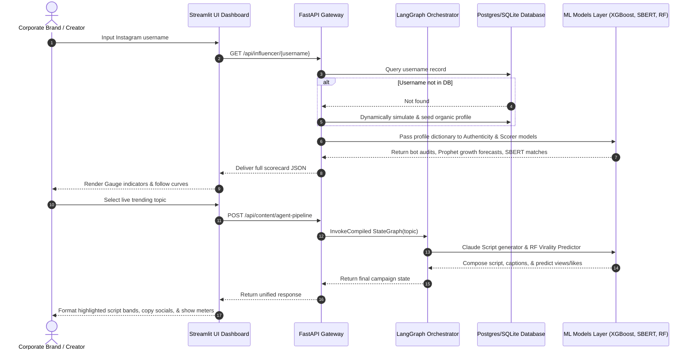

# 🛡️ Ratefluencer System Architecture Guide

Ratefluencer AI Platform is a modular, decoupled microservices ecosystem that delivers influencer intelligence auditing (Track 1) and autonomous content scripting/virality forecasting (Track 2) for corporate digital marketing.

---

## 🏗️ 1. Six-Layer Decoupled Design

The software follows a strictly isolated 6-layer architectural layout:

```
+-------------------------------------------------------------+
| 1. Frontend Layer: Streamlit Obsidian Dark UI, Plotly Charts|
+------------------------------+------------------------------+
                               | REST JSON
                               v
+-------------------------------------------------------------+
| 2. Gateway Layer: FastAPI CORS REST Gateway                 |
+------------------------------+------------------------------+
                               |
                               v
+-------------------------------------------------------------+
| 3. Agent Layer: Sequential LangGraph Agent Pipeline          |
+------------------------------+------------------------------+
                               |
                               v
+-------------------------------------------------------------+
| 4. ML Models: XGBoost, IsolationForest, SBERT Vector, RF    |
+------------------------------+------------------------------+
                               |
                               v
+-------------------------------------------------------------+
| 5. Ingestion: PRAW Reddit, YouTube APIs, RSS Feedparser     |
+------------------------------+------------------------------+
                               |
                               v
+-------------------------------------------------------------+
| 6. Persistence: PostgreSQL/SQLite SQLAlchemy ORM, Redis Cache|
+-------------------------------------------------------------+
```

### Layer Details:
1.  **Frontend Layer:** Injects premium CSS styling ( gow-titles,Outfit/Inter typography, and glassmorphic metric borders) directly into the Streamlit session. Standardizes gauge indicator sweeps and forecasting timelines using Plotly wrappers.
2.  **Gateway Layer (FastAPI):** Exposes 8 rest endpoints validating client requests against Pydantic schema serializers. Implements global CORS parameters for front-end client rendering.
3.  **Agent Layer (LangGraph):** Orchestrates sequential states (`trend_node` → `script_node` → `caption_node` → `virality_node`) carrying custom states. Implements a thread-safe Python fallback runner to bypass graph failures if the third-party `langgraph` package is missing.
4.  **Core ML Models Layer:** Archives pre-trained pickle weights (`models/saved/*.pkl`) comprising an Isolation Forest anomaly classifier, a Prophet forecaster, an SBERT vector index, and a Random Forest regressor.
5.  **Ingestion & Scraping Layer:** Integrates PRAW Reddit, YouTube Data API, and Feedparser RSS, complete with robust, offline simulated trend generators to ensure out-of-the-box demo coverage.
6.  **Persistence & Cache Layer:** Directs database session management via SQLAlchemy. Connection managers automatically fallback from default PostgreSQL ports (`5432`) to a local SQLite `ratefluencer.db` file if Postgres services are offline, facilitating instant local startup.

---

## 📊 2. Data Flow Architecture

The dynamic system execution pipelines map as follows:



---

## 🤖 3. Machine Learning Model Selection & Mathematical Justifications

### A. Bot & Fraud Detection: `IsolationForest`
*   **Why:** Follower fraud (bought followings and bot farms) does not have labeled supervision datasets. Standard supervised classification is impractical.
*   **Math:** Bots are outliers (anomalies) in high-dimensional feature spaces. `Isolation Forest` isolates anomalies by randomly partitioning feature ranges. Because anomalies require fewer splits to be isolated, they appear closer to the root of decision trees (shorter average path lengths $h(x)$).
*   **Features:** $[ER, \log_{10}(Followers/Following), SpikeScore]$. If a bot dump occurs, the spike score rises, producing low average paths, resulting in low Authenticity Scores.

### B. Follower Growth Forecasting: `FB Prophet`
*   **Why:** Traditional ARIMA models require strict stationary time-series data and do not handle sudden spikes or strong weekly social networking seasonality (e.g. higher engagements on weekends).
*   **Math:** Prophet models time-series as an additive regression:
    $$y(t) = g(t) + s(t) + h(t) + \epsilon_t$$
    where $g(t)$ represents non-periodic growth trends, $s(t)$ models weekly seasonality, and $h(t)$ incorporates outlier events. This captures organic creator scaling accurately.

### C. Campaign Brief Matching: `Sentence-BERT` (SBERT)
*   **Why:** Standard lexical search (TF-IDF/BM25) fails to capture semantic meaning (e.g. "active gym-wear brand" will not match a bio "weightlifter sharing nutrition tips" since there is no overlapping vocabulary).
*   **Math:** SBERT uses Siamese networks to project text sentences into a highly structured 384-dimensional vector space. Semantic similarity is calculated as the cosine between text embeddings $\vec{u}$ and $\vec{v}$:
    $$\text{Similarity} = \frac{\vec{u} \cdot \vec{v}}{\|\vec{u}\| \|\vec{v}\|}$$
    yielding robust match relevance scores.

### D. Campaign Success: `XGBoost` / `GradientBoosting`
*   **Why:** XGBoost represents the gold-standard algorithm for tabular feature data. It consistently outperforms deep neural networks on low-dimensional structured records.
*   **Math:** It iteratively fits decision trees by minimizing an objective function containing an additive regularization term $\Omega(f_t)$ to penalize model complexity and prevent overfitting:
    $$\mathcal{L}^{(t)} = \sum_{i=1}^{n} l\left(y_i, \hat{y}_i^{(t-1)} + f_t(x_i)\right) + \Omega(f_t)$$
    This outputs robust, highly accurate success probabilities.

### E. Script Virality Forecasting: `Random Forest Regressor`
*   **Why:** Virality is multi-variable (simultaneously predicting views, likes, and shares). It is dependent on low-cardinality script traits (intro hooks, CTA endings).
*   **Math:** `Random Forest Regressor` uses bootstrap aggregation (bagging) of numerous decorrelated decision trees, reducing forecasting variance and yielding robust expected metrics.

---

## 🔌 4. API Schema Reference

All JSON payloads standardise under the `BaseResponse` format:

```json
{
  "success": true,
  "data": {},
  "error": null
}
```

### Endpoints Catalog:

#### 1. `GET /`
*   **Purpose:** Backend API health status check.
*   **Response data:** `{"status": "Online", "service": "Ratefluencer", "version": "1.0.0"}`

#### 2. `GET /api/influencer/{username}`
*   **Purpose:** Evaluates and audits a creator handle.
*   **Response data:**
    ```json
    {
      "profile": {"username": "@tech_guru", "followers": 150000},
      "authenticity_score": 95.5,
      "growth_score": 85.0,
      "ratefluencer_score": 88.2,
      "historical_history": [140000, 150000],
      "predicted_history": [151000, 155000]
    }
    ```

#### 3. `POST /api/influencer/analyze`
*   **Purpose:** Accepts manual creator JSON payloads to audit.
*   **Request body:** `{"followers": 25000, "avg_likes": 2000, "posting_frequency": 3.5}`

#### 4. `GET /api/influencer/{id}/brand-matches`
*   **Purpose:** Gets top 5 matching product campaigns for a creator.
*   **Response list:** `[{"brand_id": 1, "name": "FitTrack", "match_score": 95.8}]`

#### 5. `POST /api/influencer/search-by-brief`
*   **Purpose:** Matches all DB creators against a written campaign brief.
*   **Request body:** `{"brief": "Seeking tech-savvy builders..."}`

#### 6. `GET /api/trends`
*   **Purpose:** Live crawls and ranks top 10 trends.
*   **Response list:** `[{"topic": "GPT-5 Video", "trend_score": 98.2}]`

#### 7. `POST /api/trends/score`
*   **Purpose:** Scores a custom topic string.
*   **Request body:** `{"topic": "Autonomous AI Agents"}`

#### 8. `POST /api/content/agent-pipeline`
*   **Purpose:** Triggers the multi-node LangGraph sequential agent.
*   **Request body:** `{"topic": "GPT-5 reasoning", "category": "tech"}`
*   **Response data:**
    ```json
    {
      "topic": "GPT-5 reasoning",
      "script": "[HOOK]... [STORY]...",
      "linkedin_post": "...",
      "instagram_caption": "...",
      "virality_score": 79.5,
      "expected_views": 47000
    }
    ```
